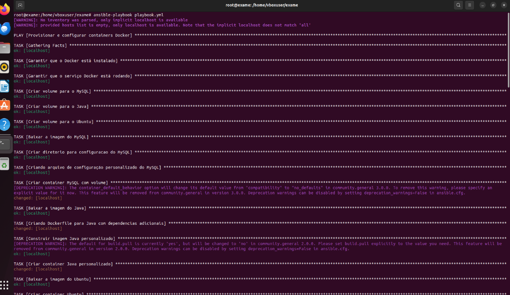
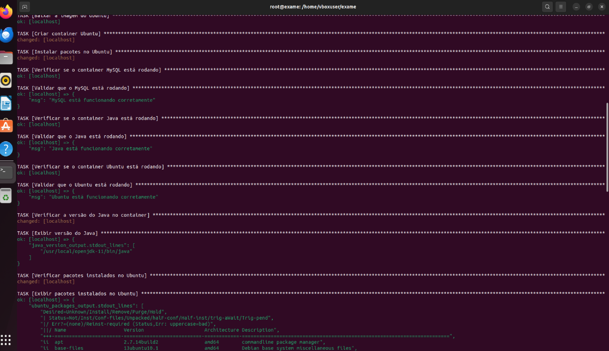
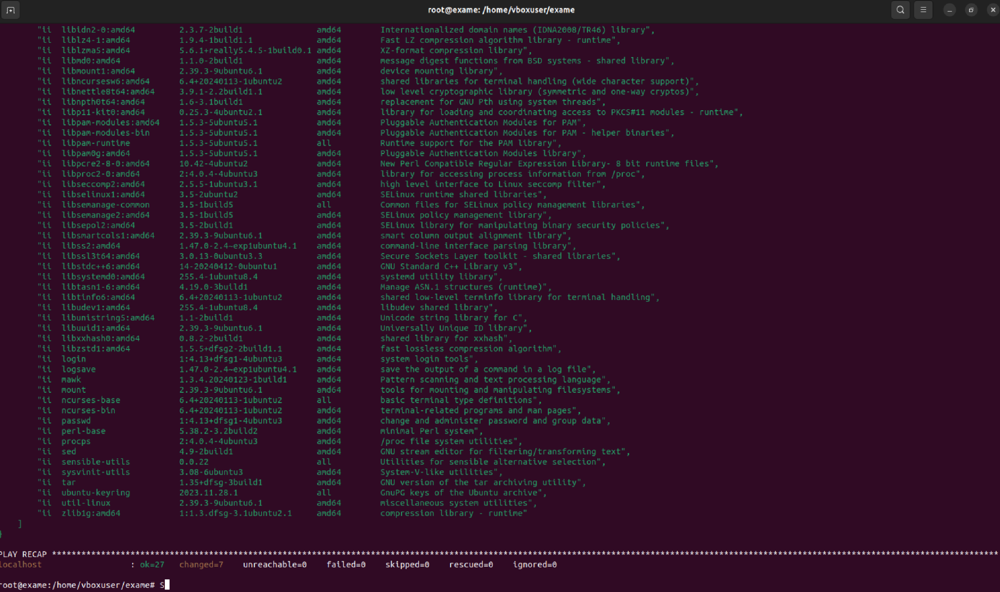

# Ansible Playbook para provisionamento e configuração de containers Docker

O seguinte projeto visa subir e configurar 3 containers, um java, um mysql e um ubuntu. O playbook foi criado com base nos ensinamentos da disciplina de IaC do curso DevOps & Continuous Software Engineering. Todo o ambiente foi realizado no linux ubuntu 22.04 via VM com Oracle Virtualbox.

------------
## Requisitos
 Para que seja possível executar é necessário ter algumas ferramentas instaladas como 

 * Ansible, utilizado na versão 2.10.8
 * Docker, utilizado na versão 24.0;7
 * Terminal para executar os comandos, utilizado bash na versão 5.1.16

## Estrutura do playbook

O playbook está dividido em várias tarefas que cuidam da instalação e configuração de três containers principais:

1. MySQL: Container para banco de dados MySQL, com configurações de volume para persistência de dados e configuração de valores via variáveis de ambiente.
2. Java: Container configurado com imagem personalizada do java, verificando a instalação correta e suas dependências.
3. Ubuntu: Container ubuntu jammy com pacotes básicos instalados.

Por fim, são realizadas validações para verificar se as tarefas foram executadas com sucesso.

## Logs

Abaixo estão as evidências da execução do ansible.

Logo abaixo é possível ver a primeira tela de execução do playbook.

Abaixo é possível ver a segunda tela de execução do playbook.

Abaixo é possível ver a última tela de execução do playbook.
